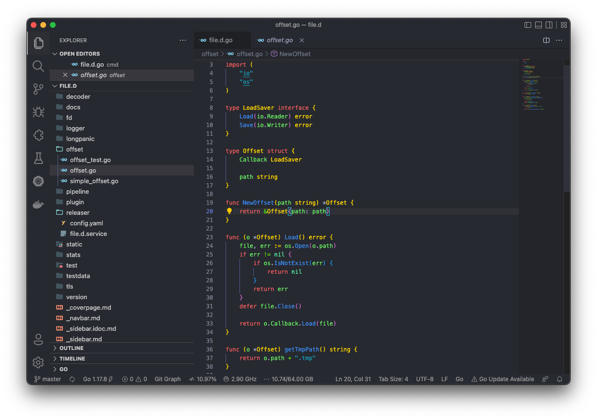
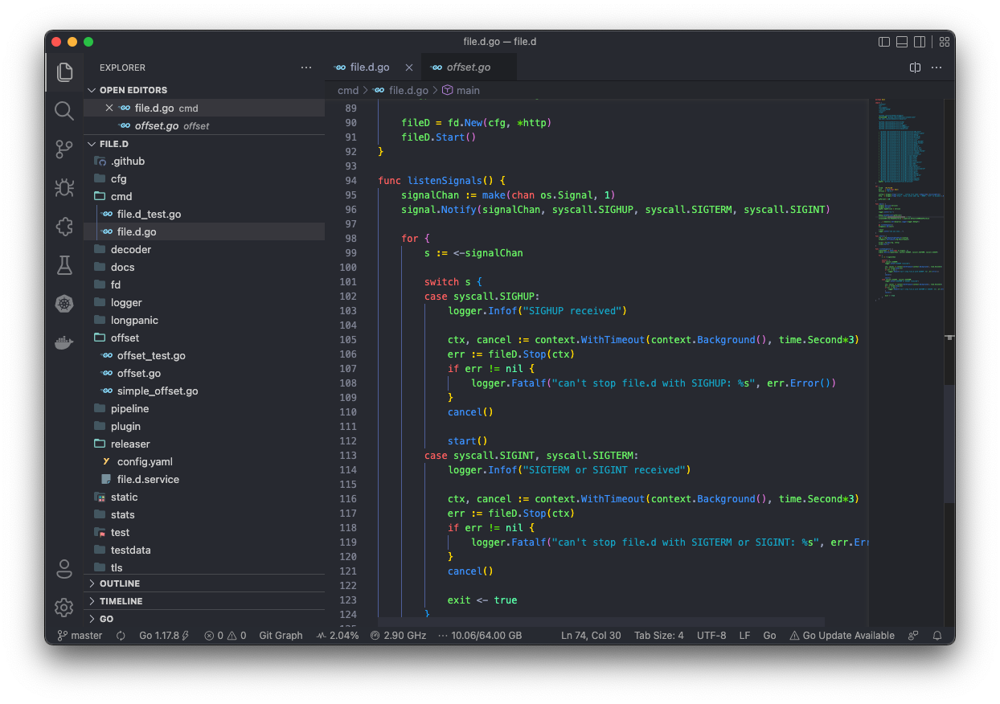

# GRAY-BLUE DARKNESS 

## VSCODE THEME
[App store link](https://marketplace.visualstudio.com/items?itemName=GREY-BLUEDARKNESS.grey-blue-darkness&ssr=false#overview)

If you have a questions you can connect whith me [here](https://runinterface.tech)

## Made with love ❤️

# Screenshots

# Changelog

You can take a look at the change log [here](https://github.com/Runinterface/GREY-BLUE-DARKNESS/blob/main/CHANGELOG.md)